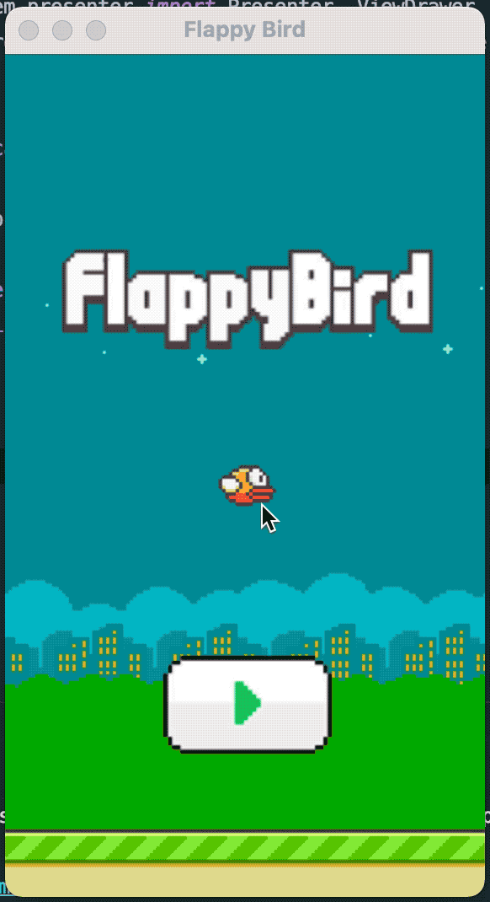

### Build status


### Motivation
The project is an assignment for a python course 🐍

### Author
Idea for the game WAS NOT my invention. Information about the original author can be found below: 
> Flappy Bird is a mobile game developed by Vietnamese video game artist and programmer Dong Nguyen (Vietnamese: Nguyễn Hà Đông), under his game development company dotGears

Assets were taken from Samuel Custodio's [repository](https://github.com/samuelcust/flappy-bird-assets)

### Tech
* python 3.8
* pygame 2.0.1

### How to use
* Clone the repository
* Install requirements calling:
```bash
pip install -r requirements.txt
```
* Switch to python 3.8 if you haven't done it already and then run:
```bash
python3 -m flappy
```

### Controls
The game supports both mouse and keyboard usage. Controlling the game with a mouse is straightforward and does not require additional explanation.
Keybindings are listed below: 
* `q` - quit the game
* `1` - change bird's color
* `2` - change background's color
* `SPACEBAR` - action button - flap/process to the next screen

### Gameplay
💥 Sound effects included
<p align="center">
    
</p>
