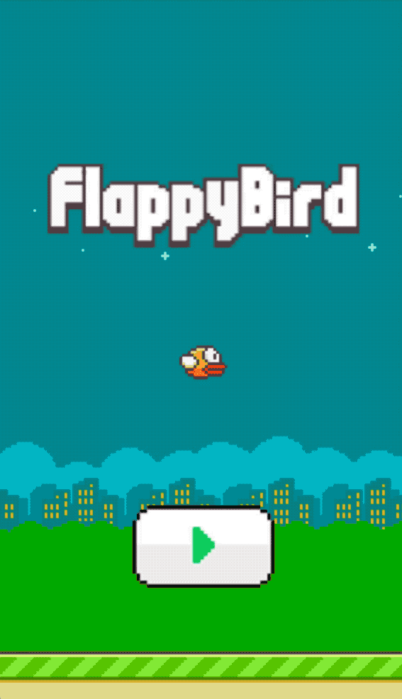

### Author
> Flappy Bird is a mobile game developed by Vietnamese video game artist and programmer Dong Nguyen (Vietnamese: Nguyễn Hà Đông), under his game development company dotGears

Assets was taken from Samuel Custodio's [repository](https://github.com/samuelcust/flappy-bird-assets)

### CI


### Running
```bash
python3 -m flappy
```

### Controls
The game supports both mouse and keyboard usage. Controlling the game with a mouse is straightforward and does not require additional explanation.
Keybindings are listed below: 
* `q` - quit the game
* `1` - change bird's color
* `2` - change background color
* `SPACEBAR` - action button - flap/process to the next screen

### Gameplay
<p align="center">
    
</p>
